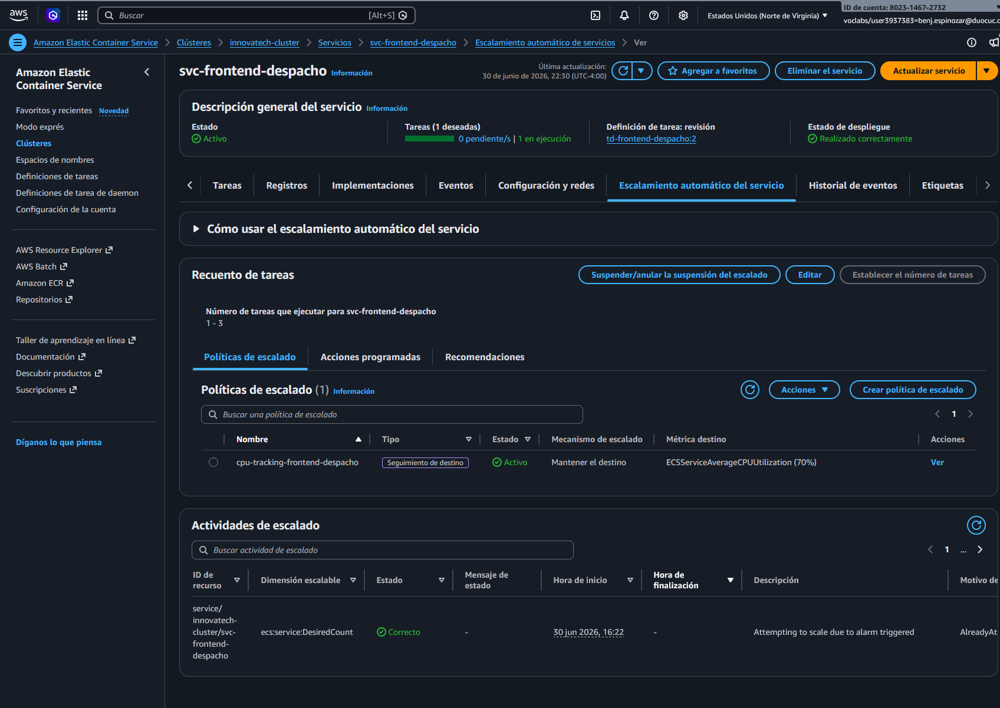
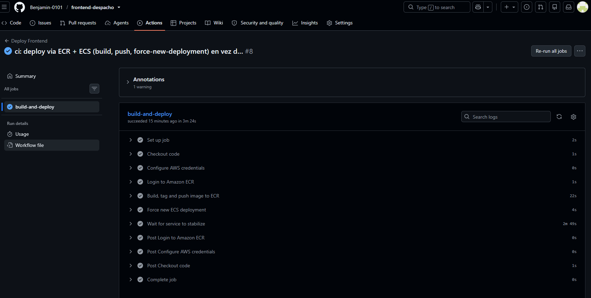
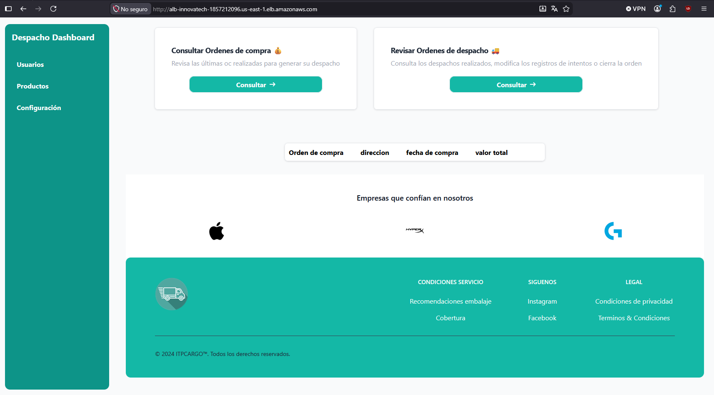

# Frontend Despacho — 

Frontend desarrollado con **React + Vite** para la gestión de despachos de Innovatech Chile. Permite visualizar, registrar y administrar los despachos de la empresa a través de una interfaz web moderna y responsiva.

Este repositorio es una de las 3 piezas del sistema desplegado en un mismo clúster **AWS ECS Fargate** (junto a [`backend-despacho`](https://github.com/Benjamin-0101/backend-despacho) y [`backend-ventas`](https://github.com/Benjamin-0101/backend-ventas)). Este README documenta el rol de este servicio en esa arquitectura y cubre los indicadores de evaluación IE1–IE7 del laboratorio EP3.

---

## Tecnologías

- React 18
- Vite
- Docker / Nginx

---

## Arquitectura del clúster (IE1)

```
Internet
   │ HTTP :80
   ▼
Application Load Balancer (alb-innovatech)
  Listener :80 — 3 reglas path-based:
    Prioridad  1: /api/v1/ventas* → tg-backend-ventas
    Prioridad 10: /api/*          → tg-backend-despacho
    Default:      /*              → tg-frontend   ◄── este servicio
  SG: alb-despacho-ep3 (80/443 desde 0.0.0.0/0)
   │
   ▼ :80
┌─────────────────────────────┐
│ ECS Fargate — svc-frontend-  │
│ despacho                     │
│                               │
│  ┌─────────────────────────┐ │
│  │ nginx:alpine             │ │
│  │ sirve el build de React  │ │
│  └─────────────────────────┘ │
│                               │
│ 256 CPU / 512 MB              │
│ SG: frontend-ecs-ep3          │
└─────────────────────────────┘

VPC: vpc-0a3f321f3d87759a7 (172.31.0.0/16) — subnets públicas us-east-1a/1b/1c
Clúster: innovatech-cluster (ECS Fargate, launch-type FARGATE directo —
  el Learner Lab no pre-crea el service-linked role AWSServiceRoleForECS,
  por lo que el clúster se creó sin especificar capacity providers)
ECR: 802314672732.dkr.ecr.us-east-1.amazonaws.com/innovatech-frontend
IAM: execution role y task role = LabRole (rol único provisto por AWS Academy
  Learner Lab; en un entorno productivo se usarían dos roles separados con
  privilegio mínimo — no fue posible crear roles IAM propios por restricción
  del Lab)
```

**Este servicio (`svc-frontend-despacho`) en el clúster:**

| Recurso | Valor |
|---|---|
| Task Definition | `td-frontend-despacho` (revisión activa `:2`) |
| CPU / Memoria | 256 / 512 |
| Contenedor | `nginx:alpine` sirviendo `dist/` (sin sidecar de base de datos) |
| ECR repo | `innovatech-frontend` |
| Security Group | `frontend-ecs-ep3` (`sg-0d1ad61ee5e1931a5`) — solo acepta tráfico desde el SG del ALB |
| Target Group | `tg-frontend`, puerto 80, health check `/` |
| Autoscaling | ver sección IE3 |

**Decisión de arquitectura relevante:** el enrutamiento Frontend↔Backend se resuelve con reglas de path en el ALB en vez de AWS Cloud Map, porque el Learner Lab bloquea el permiso `servicediscovery:CreatePrivateDnsNamespace`. Esto simplificó este servicio: `nginx.conf` solo sirve estáticos y hace fallback a `index.html` para el routing SPA — el navegador llama directamente a `/api/v1/despachos` y `/api/v1/ventas` contra el mismo dominio del ALB, sin proxy inverso de por medio.

---

## Requisitos previos

- [Docker](https://www.docker.com/) y Docker Compose instalados

---

## Variables de entorno

Copia el archivo `.env.example` como `.env` en la raíz del proyecto y completa los valores:

```bash
cp .env.example .env
```

| Variable | Descripción |
|---|---|
| `VITE_API_URL` | URL base de la API de despachos (en producción no se usa: el frontend llama directamente al DNS del ALB, que enruta por path) |

---

## Correr localmente

```bash
docker-compose up --build
```

La aplicación estará disponible en [http://localhost:80](http://localhost:80).

---

## Estructura Docker

El proyecto usa un **Dockerfile multi-stage**:

- **Stage 1** — Node 20 Alpine compila el proyecto con `npm run build`
- **Stage 2** — Nginx Alpine sirve los archivos estáticos del directorio `dist/`

El archivo `nginx.conf` sirve estáticos y hace fallback a `index.html` para el enrutamiento SPA. No contiene `proxy_pass` hacia los backends — esa responsabilidad la asumió el ALB (ver IE1).

---

## Despliegue en el clúster (IE2)

El servicio se despliega desde una imagen construida y publicada en **ECR** (no Docker Hub), y el tráfico llega exclusivamente a través del **ALB** — el contenedor nunca recibe tráfico directo de internet.

```
CI/CD push imagen a ECR (innovatech-frontend:latest)
        │
        ▼
ECS Fargate lanza tarea nueva de svc-frontend-despacho
  (pull de la imagen :latest actualizada, 256 CPU / 512 MB)
        │
        ▼
Tarea pasa el health check HTTP GET / en el puerto 80
        │
        ▼
ALB registra la tarea en tg-frontend y le enruta tráfico (regla default /*)
```

- **Puerto expuesto:** 80 (HTTP), único puerto del contenedor.
- **Variables/entorno:** ninguna variable de runtime — el build de Vite es estático, no requiere configuración en tiempo de ejecución.
- **Balanceador operativo:** confirmado — ver IE7 (validación funcional).

---

## Configuración de Autoscaling (IE3)

| Servicio | Métrica | Umbral | Min | Max | Scale-Out | Scale-In |
|---|---|---|---|---|---|---|
| `svc-frontend-despacho` | CPU promedio (Target Tracking) | **70%** | 1 | 3 | 60 s | 120 s |

**Justificación del umbral de 70% CPU:**

1. **Margen ante picos súbitos:** al escalar en 70% (no 90%), la nueva tarea Fargate tiene ventana para arrancar (cold start de nginx, rápido: sub-10s en este caso al no tener sidecar) antes de que la tarea existente llegue al 100%.
2. **Balance costo/disponibilidad académico:** un umbral de 50% escalaría ante carga moderada normal, triplicando el costo Fargate sin necesidad real en un entorno de laboratorio.
3. **Cooldowns asimétricos (60 s scale-out / 120 s scale-in):** reacción rápida ante picos, pero conservadora para bajar tareas — evita thrashing si la carga fluctúa brevemente.

En producción se añadiría una política de memoria complementaria; no se implementó aquí porque este contenedor no tiene sidecar y su consumo de memoria es predecible y bajo (256/512 son holgados para nginx sirviendo estáticos).



*Política `cpu-tracking-frontend-despacho` (Target Tracking, 70% CPU) activa en la consola ECS — pestaña "Auto Scaling" del servicio `svc-frontend-despacho`.*

---

## Pipeline CI/CD (IE4)

Definido en [`.github/workflows/deploy.yml`](.github/workflows/deploy.yml), se dispara automáticamente en cada `push` a la rama `deploy`.

```
push a rama "deploy"
   │
   ▼
Checkout del código
   │
   ▼
configure-aws-credentials (Secrets: AWS_ACCESS_KEY_ID / AWS_SECRET_ACCESS_KEY / AWS_SESSION_TOKEN)
   │
   ▼
Login a ECR (aws-actions/amazon-ecr-login)
   │
   ▼
docker build → tag :${{ github.sha }} y :latest
   │
   ▼
docker push (ambos tags)
   │
   ▼
aws ecs update-service --force-new-deployment
   │
   ▼
aws ecs wait services-stable   (el job no termina "en verde" hasta que ECS confirma
                                 runningCount = desiredCount en el servicio real)
```

**Por qué es seguro:**
- Las credenciales AWS viven únicamente como GitHub Secrets cifrados, nunca en el código ni en el `deploy.yml`.
- Son credenciales **temporales** (Access Key + Secret Key + Session Token de AWS Academy Learner Lab), no un usuario IAM permanente — reduce la ventana de exposición si se filtran.
- No se usa OIDC/role federation porque el Learner Lab no lo soporta; es la alternativa más segura disponible dentro de esa restricción.
- La imagen se etiqueta con el SHA del commit además de `latest`, dejando trazabilidad exacta de qué código generó cada imagen en ECR.

**Por qué es funcional (evidencia real, no solo "en verde"):** el paso final no es un simple "deploy exitoso" — corre `aws ecs wait services-stable`, que falla activamente si el servicio no alcanza el estado estable. Ver IE6 para tiempos reales y IE7 para la validación del servicio ya desplegado.



*Ejecución real del pipeline (run #8, `28485939018`, 3m24s) con todos los steps expandidos — checkout, credenciales AWS, login ECR, build/push, force-new-deployment y wait-for-stable, todos en verde.*

---

## Gestión de Secrets y credenciales (IE5)

Este servicio no maneja credenciales de base de datos (no tiene sidecar de BD). Los únicos secrets involucrados son los de CI/CD:

| Secret (GitHub Actions) | Uso | Notas de seguridad |
|---|---|---|
| `AWS_ACCESS_KEY_ID` | Autenticación AWS temporal | Regenerado por sesión del Learner Lab, nunca hardcodeado |
| `AWS_SECRET_ACCESS_KEY` | Autenticación AWS temporal | Idem — cifrado por GitHub, no legible tras guardarse |
| `AWS_SESSION_TOKEN` | Token de sesión temporal (requerido junto a las credenciales del Lab) | Expira en pocas horas — mitiga el riesgo de una fuga permanente |

No hay secrets hardcodeados en el repositorio, `Dockerfile`, `nginx.conf` ni en el historial de commits — confirmado por inspección manual del diff antes de cada commit de esta fase.

---

## Análisis de logs, métricas y tiempos del pipeline (IE6)

### Tiempos reales del pipeline (Actions, `deploy` branch)

| Run | Resultado | Duración |
|---|---|---|
| [`28485939018`](https://github.com/Benjamin-0101/frontend-despacho/actions/runs/28485939018) — push de prueba (2026-07-01) | ✅ success | **3m24s** |

Es, de los 3 servicios, el pipeline más rápido — consistente con que el contenedor no tiene sidecar de base de datos ni dependencias externas que esperar en el health check.

### Ejemplo real de logs (CloudWatch, log group `ecs-frontend-despacho`)

```
172.31.15.137 - - [01/Jul/2026:01:53:10 +0000] "GET / HTTP/1.1" 200 459 "-" "ELB-HealthChecker/2.0" "-"
172.31.83.8 - - [01/Jul/2026:01:53:28 +0000] "GET / HTTP/1.1" 200 459 "-" "ELB-HealthChecker/2.0" "-"
```

Acceso log de Nginx confirmando `200 OK` en las health checks periódicas del ALB (`ELB-HealthChecker/2.0`) contra el path `/`.

### Conclusión del análisis

El servicio estabiliza consistentemente en menos de 4 minutos de pipeline y no ha registrado errores en sus logs desde el primer despliegue exitoso — a diferencia de los backends (ver sus READMEs), que sí presentaron un crash-loop por un problema de configuración JDBC. La ausencia de estado (sin BD) hace de este el servicio de menor riesgo operacional del sistema.

Cómo consultar los logs en cualquier momento:

**Vía consola AWS:** `CloudWatch → Log groups → ecs-frontend-despacho → (elegir el stream ecs/frontend-despacho/<task-id> más reciente)`

**Vía AWS CLI:**
```bash
# Seguir los logs en vivo (últimos 10 minutos + nuevos eventos)
aws logs tail ecs-frontend-despacho --follow --since 10m --region us-east-1

# Ver los últimos 60 minutos sin seguir en vivo
aws logs tail ecs-frontend-despacho --since 60m --region us-east-1
```

---

## Validación funcional del clúster — Frontend → Backend (IE7)

Validado end-to-end contra el DNS público del ALB (2026-07-01):


*Evidencia directa de IE1 (clúster funcional), IE2 (los 3 servicios desplegados correctamente) e IE7 (validación funcional): consola ECS mostrando `svc-frontend-despacho`, `svc-backend-despacho` y `svc-backend-ventas` con `runningCount = desiredCount = 1`, capturada después del fix del crash-loop JDBC.*

```bash
# Frontend real (servido por este contenedor)
curl -I http://alb-innovatech-1857212096.us-east-1.elb.amazonaws.com
# → 200 OK, contenido HTML real del build de React

# Desde el navegador, el frontend consume directamente estos endpoints
# (mismo dominio del ALB, sin proxy en nginx — ver IE1):
curl http://alb-innovatech-1857212096.us-east-1.elb.amazonaws.com/api/v1/despachos
curl http://alb-innovatech-1857212096.us-east-1.elb.amazonaws.com/api/v1/ventas
# → ambos responden JSON válido (arreglo vacío — sin datos de prueba cargados aún)
```



*Prueba de integración Frontend → Backend: la interfaz React consumiendo datos reales desde el backend a través del ALB, confirmando que el routing por path y la comunicación end-to-end funcionan.*

**Recuperación post-deploy demostrada:** cada `push` a `deploy` ejecuta `aws ecs update-service --force-new-deployment`, que dispara un *rolling update* — ECS arranca la tarea nueva, espera que pase el health check, recién ahí drena y mata la tarea vieja. El servicio nunca queda sin tareas sanas durante el despliegue. Esto se puede reproducir en vivo con:

```bash
aws ecs update-service --region us-east-1 \
  --cluster innovatech-cluster --service svc-frontend-despacho --force-new-deployment

aws ecs describe-services --region us-east-1 \
  --cluster innovatech-cluster --services svc-frontend-despacho \
  --query "services[0].{Running:runningCount,Pending:pendingCount,Deployments:deployments[*].{Status:status,Running:runningCount,Desired:desiredCount}}" \
  --output table
```

---

## Logs — CloudWatch

*(ver sección IE6 arriba — se mantiene aquí también por referencia rápida)*

---

## Infraestructura

La aplicación corre en **ECS Fargate** (serverless, sin gestión de instancias EC2) dentro del clúster `innovatech-cluster`. El único punto de entrada público al sistema es el **ALB** (`alb-innovatech`); este contenedor no tiene IP pública alcanzable directamente — todo el tráfico externo pasa primero por el Security Group `alb-despacho-ep3` y luego por `frontend-ecs-ep3`, que solo acepta conexiones desde el SG del ALB.
